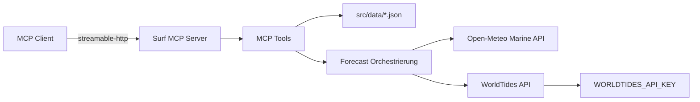
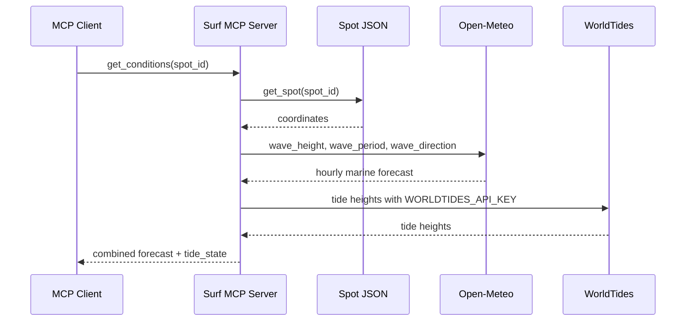
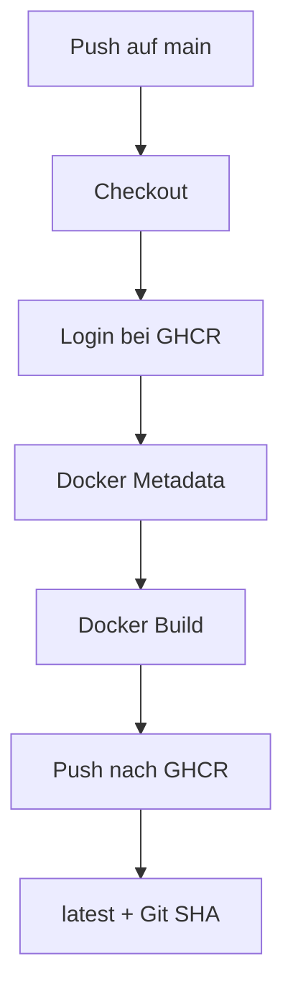
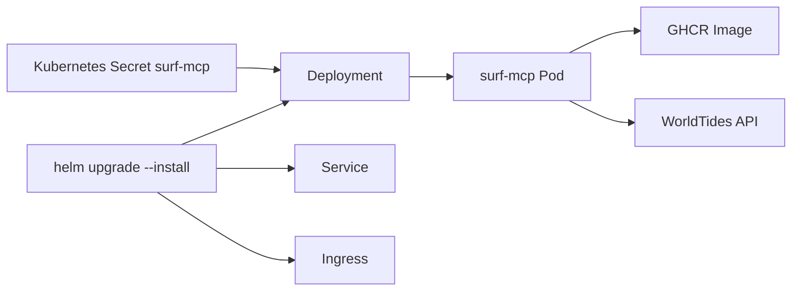

# Surf MCP Server

Ein MCP Server fuer Surfspot-Daten, Spot-Suche, Marine Forecasts und Tide-Daten.
Die Spot-Daten liegen als JSON-Dateien unter `src/data/`. Forecasts kommen ueber
Open-Meteo Marine, Tide-Daten ueber WorldTides.

Der Server laeuft lokal per Python oder als Container in Kubernetes ueber das
mitgelieferte Helm Chart.

## Architektur



## Voraussetzungen

- Python `>=3.10`
- Zugriff auf dieses Repo
- Installation der Python-Abhaengigkeiten aus `pyproject.toml`
- Optional: `uv`
- Fuer Tide-Daten: WorldTides API Key als `WORLDTIDES_API_KEY`

Abhaengigkeiten:

- `mcp[cli]`
- `requests`

## Lokales Setup

Vom Repo-Root aus:

```bash
cd surf-mcp-server
python -m venv .venv
source .venv/bin/activate
python -m pip install -U pip
python -m pip install -e .
```

Alternativ mit `uv`:

```bash
cd surf-mcp-server
uv sync
```

## Konfiguration

Open-Meteo braucht keinen API Key. Fuer WorldTides muss ein API Key gesetzt sein,
wenn `get_tides` oder `get_conditions` genutzt werden:

```bash
export WORLDTIDES_API_KEY="..."
```

## Server starten

```bash
python src/server.py
```

Der Server startet mit `streamable-http` auf `0.0.0.0:8000`:

```python
mcp.run(transport="streamable-http")
```

Wenn du ihn auf einem anderen System testest, reicht normalerweise:

1. Repo kopieren oder klonen
2. Python-Umgebung erstellen
3. Dependencies installieren
4. `WORLDTIDES_API_KEY` setzen, falls Tide-Daten genutzt werden
5. `python src/server.py` aus dem Repo-Root ausfuehren

## Projektstruktur

```text
surf-mcp-server/
|-- .github/workflows/build.yml   # GitHub Actions Build Pipeline
|-- charts/surf-mcp/              # Helm Chart
|-- src/
|   |-- server.py                  # MCP Tools und Server-Start
|   |-- spots.py                   # Laden der Spot-Dateien
|   |-- forecast.py                # Forecast- und Tide-Orchestrierung
|   |-- data/                      # Surfspot JSON-Dateien
|   `-- providers/
|       |-- open_meteo.py          # Open-Meteo Marine API
|       |-- worldtides.py          # WorldTides API
|       `-- stormglass.py          # Vorbereiteter Provider
|-- tests/                         # Unit Tests
|-- Dockerfile
|-- pyproject.toml
|-- uv.lock
`-- README.md
```

## Forecast Flow



## Verfuegbare MCP Tools

### `list_regions()`

Gibt alle verfuegbaren Regionen zurueck.

Beispiel-Resultat:

```json
["Airport Reefs", "Lakey", "Uluwatu", "Ungasan", "West Sumbawa"]
```

### `list_spots(region: string | null = null)`

Listet Spots. Optional kann nach Region gefiltert werden.

Beispiel:

```json
{
  "region": "Uluwatu"
}
```

Resultat enthaelt:

```json
{
  "id": "uluwatu_the_peak",
  "name": "Uluwatu - The Peak",
  "country": "Indonesia",
  "island": "Bali",
  "region": "Uluwatu"
}
```

### `get_spot_info(spot_id: string)`

Gibt alle Details fuer einen Spot zurueck.

Beispiel:

```json
{
  "spot_id": "lakey_peak"
}
```

### `find_spots(...)`

Findet Spots anhand mehrerer Kriterien.

Parameter:

- `skill`: z.B. `intermediate`, `advanced`, `expert`
- `country`: z.B. `Indonesia`
- `island`: z.B. `Bali` oder `Sumbawa`
- `region`: z.B. `Uluwatu`, `Lakey`, `West Sumbawa`
- `tide`: z.B. `low`, `mid`, `high`
- `wind`: z.B. `SE`, `N`, `NW`
- `swell_direction`: z.B. `S`, `SW`, `W`
- `swell_height_ft`: z.B. `4`

Beispiel:

```json
{
  "skill": "intermediate",
  "island": "Bali",
  "region": "Uluwatu",
  "tide": "mid",
  "wind": "SE",
  "swell_direction": "SW",
  "swell_height_ft": 4
}
```

### `count_spots()`

Gibt die Anzahl der Spot-Dateien zurueck.

### `search_spots(query: string)`

Sucht Spots nach Name.

Beispiel:

```json
{
  "query": "uluwatu"
}
```

### `get_forecast(spot_id: string)`

Gibt den normalisierten Marine Forecast fuer einen Spot zurueck.

Die Daten kommen aus Open-Meteo Marine:

- `wave_height_ft`
- `wave_period_s`
- `swell_direction`
- `swell_direction_deg`

Beispiel-Resultat:

```json
[
  {
    "time": "2026-06-11T00:00",
    "wave_height_ft": 4.6,
    "wave_period_s": 12.1,
    "swell_direction": "SW",
    "swell_direction_deg": 225
  }
]
```

### `get_tides(spot_id: string)`

Gibt Tide-Daten fuer einen Spot zurueck.

Die Daten kommen aus WorldTides. Dafuer muss `WORLDTIDES_API_KEY` gesetzt sein.

Beispiel-Resultat:

```json
[
  {
    "time": "2026-06-11T00:00+0000",
    "tide_height_ft": 3.2,
    "tide_state": "mid"
  }
]
```

### `get_conditions(spot_id: string)`

Kombiniert Marine Forecast und Tide-Daten. Pro Forecast-Zeitpunkt wird die
naechste Tide gesucht und als `tide_height_ft` und `tide_state` ergaenzt.

Beispiel-Resultat:

```json
[
  {
    "time": "2026-06-11T00:00",
    "wave_height_ft": 4.6,
    "wave_period_s": 12.1,
    "swell_direction": "SW",
    "swell_direction_deg": 225,
    "tide_height_ft": 3.2,
    "tide_state": "mid"
  }
]
```

## Docker

Image lokal bauen:

```bash
docker build -t surf-mcp-server .
```

Container starten:

```bash
docker run --rm \
  -p 8000:8000 \
  -e WORLDTIDES_API_KEY="$WORLDTIDES_API_KEY" \
  surf-mcp-server
```

## GitHub Build Pipeline

Die Pipeline liegt unter `.github/workflows/build.yml`.



Bei jedem Push auf `main` wird ein Container Image gebaut und nach GHCR
gepusht:

- `ghcr.io/steph76k/surf-mcp-server:latest`
- `ghcr.io/steph76k/surf-mcp-server:<git-sha>`

Die Pipeline nutzt `GITHUB_TOKEN` mit `packages: write`.

## Kubernetes Deployment mit Helm

Das Helm Chart liegt unter `charts/surf-mcp/`.



### WorldTides Secret erstellen

Vor dem Helm Deployment muss der WorldTides API Key als Kubernetes Secret
angelegt werden:

```bash
kubectl create secret generic surf-mcp \
  --from-literal=worldtides-api-key="$WORLDTIDES_API_KEY"
```

Das Chart liest den Key standardmaessig aus diesem Secret:

```yaml
env:
  - name: WORLDTIDES_API_KEY
    valueFrom:
      secretKeyRef:
        name: surf-mcp
        key: worldtides-api-key
```

### Installieren oder aktualisieren

```bash
helm upgrade --install surf-mcp charts/surf-mcp \
  --namespace surf-mcp \
  --create-namespace
```

Standardwerte aus `charts/surf-mcp/values.yaml`:

- Image: `ghcr.io/steph76k/surf-mcp-server:latest`
- Service: `ClusterIP` auf Port `8000`
- Ingress: Traefik
- Host: `surf-mcp.rke2-cluster1.berger.ph`
- Secret: `surf-mcp` mit Key `worldtides-api-key`

### Image Tag ueberschreiben

```bash
helm upgrade --install surf-mcp charts/surf-mcp \
  --namespace surf-mcp \
  --create-namespace \
  --set image.tag="<git-sha>"
```

### Manifest lokal pruefen

```bash
helm template surf-mcp charts/surf-mcp
```

## Spot JSON Schema

Jeder Spot ist eine eigene JSON-Datei in `src/data/`. Der Dateiname sollte zur
`spot_id` passen.

Beispiel:

```json
{
  "spot_id": "uluwatu_the_peak",
  "name": "Uluwatu - The Peak",
  "country": "Indonesia",
  "island": "Bali",
  "region": "Uluwatu",
  "coordinates": {
    "lat": -8.816633,
    "lon": 115.08625
  },
  "conditions": {
    "swell": {
      "directions": ["S", "SW"],
      "min_ft": 1,
      "max_ft": 6
    },
    "wind": {
      "offshore": ["SE"]
    },
    "tide": ["mid", "high"]
  },
  "wave": {
    "direction": "left",
    "type": "reef"
  },
  "ratings": {
    "crowd": 10,
    "localism": 9,
    "risk": 6,
    "fun": 9
  },
  "surfer_level": ["intermediate", "advanced"],
  "notes": "At high tide, aim south of the cave when coming in.",
  "description": "Short description of the spot.",
  "hazards": [
    "sharp coral reef",
    "strong currents"
  ]
}
```

## Wichtige Daten-Konventionen

### `surfer_level`

`surfer_level` ist immer ein Array, damit die Suche einzelne Levels sauber
matchen kann:

```json
{
  "surfer_level": ["intermediate", "advanced"]
}
```

Nicht mehr verwenden:

```json
{
  "surfer_level": "intermediate / advanced"
}
```

Empfohlene Werte:

- `beginner`
- `intermediate`
- `advanced`
- `expert`

### Location Felder

`country`, `island` und `region` sind getrennte Felder:

```json
{
  "country": "Indonesia",
  "island": "Bali",
  "region": "Uluwatu"
}
```

Nicht mehr verwenden:

```json
{
  "region": "Bali - Uluwatu Area"
}
```

## Aktuelle Regionen

- `Airport Reefs`
- `Lakey`
- `Uluwatu`
- `Ungasan`
- `West Sumbawa`

## Neue Spots hinzufuegen

1. Neue Datei in `src/data/` erstellen, z.B. `my_spot.json`
2. `spot_id` passend zum Dateinamen setzen, z.B. `my_spot`
3. Schema wie oben verwenden
4. JSON validieren:

```bash
jq empty src/data/my_spot.json
```

Alle Spot-Dateien validieren:

```bash
for f in src/data/*.json; do jq empty "$f" || exit 1; done
```

## Tests und Checks

```bash
python -m compileall src
python -m unittest discover -s tests
helm template surf-mcp charts/surf-mcp
```

## Hinweise

- Spot-Daten werden bei jedem Tool-Aufruf direkt aus `src/data/*.json` gelesen.
- `get_forecast` nutzt Open-Meteo Marine und braucht keinen API Key.
- `get_tides` und `get_conditions` nutzen WorldTides und brauchen `WORLDTIDES_API_KEY`.
- `src/providers/stormglass.py` ist als optionaler Provider vorbereitet.
- Das Helm Chart nutzt standardmaessig die im Docker Image enthaltenen Spot-Daten.
- Ein externer ConfigMap-Mount fuer Spot-Daten kann ueber `spotData.configMap.enabled=true` aktiviert werden.
